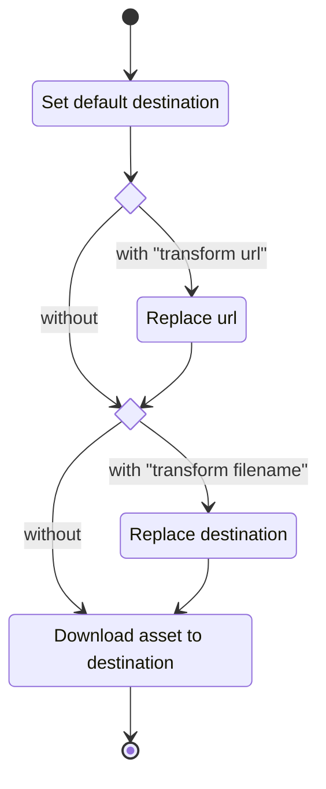

# Advanced configuration

## Asset block behavior



<details>
<summary>Go pseudocode</summary>

```go
// loop through every url matching the asset pattern
for _, url := range parsed_urls {
    // by default, the destination is the last element of the original url
    destination := basename(url)

    // do we have a "transform url" block?
    if has_transform_url {
        // perform substitution of the original url with regex
        url = regex(pattern, replacement, assetUrl)
    }

    // do we have a "transform filename" block?
    if has_transform_filename {
        // perform substitution of the original destination with regex
        destination = regex(pattern, replacement, destination)
    }

    // download with the network options
    response := fetch(url)

    // save the file
    return write_file(destination, response)
}
```

</details>
