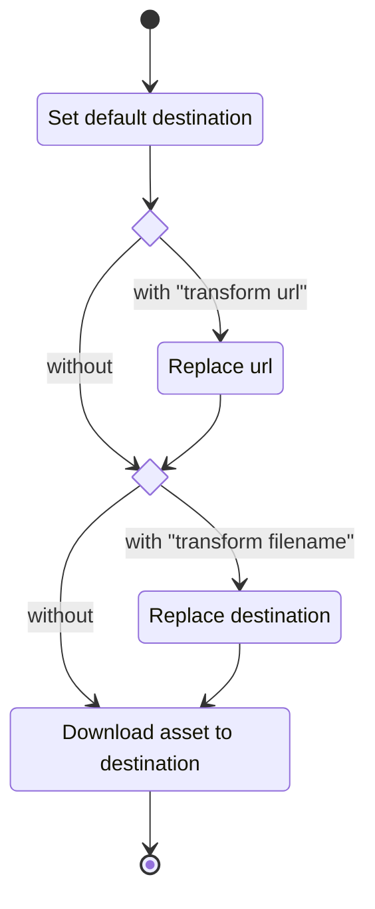

# Scraping with GRAB

Let's set an example.

Say we have a website `https://example.com` that hosts galleries of pictures and videos curated by users. We want to download all the images and video files in the gallery, and we also want to save some text information, like the username of the curator.

An example gallery, located at `https://example.com/gallery/1337` would look something like this:

```html
<html>
  <head>
    <title>My awesome gallery</title>
  </head>
  <body>
    <h1>My awesome gallery</h1>
    <p>
      Curated by <a href="https://example.com/user/everdrone">@everdrone</a>
    </p>
    <p>Wednesday, August 17, 2022</p>
    <div>
      <h1>images</h1>
      
      
      
      <video
        src="https://cdn.example.com/video/1337/39808447626_small.mp4"
      ></video>
    </div>
  </body>
</html>
```

To get the gallery curator we could parse the url to get whatever comes after `user/`. We also have the title both inside `<title>` and inside `<h1>`, the video and image urls are also easily accessible.

## The basics

Let's start by generating a new configuration file using `grab config generate`. Remove everything inside the new `grab.hcl` file and write the following:

```hcl
global {
  location = "/home/<username>/Downloads/grab"
}
```

Replace the path with any directory you want, we will refer to this path as `global.location`.

This will tell grab where to store everything: sites, images, videos, information.

Let's add a `site` block called `example`, then an attribute `test` with the regular expression that will check if we actually are on `https://example.com`.  
In there we also want to have two `asset` blocks, one for images and one for videos.

```
global {
  location = "/home/<username>/Downloads/grab"
}

site "example" {
  test = ":\\/\\/example\\.com"

  asset "image" {
    pattern  = "[^\"]+)"
    capture  = "video_url"
    find_all = true
  }
}
```

> **Note**  
> To learn how to escaping regular expressions in HCL, refer to the [section below](#regexp-and-hcl-strings).

If you're familiar with Regular Expressions, the patterns above should be pretty easy to understand, but we'll go through them here anyway.  
The `asset[image].pattern` expression captures whatever comes after `)` group.

> **Warning**  
> If the `pattern` attribute contains named groups, you must set the `capture` to a string representing the name of the group.  
> Use an integer `capture` only if your `pattern` does not contain named groups.
>
> To learn more about Go's regexp syntax see the [official documentation](https://pkg.go.dev/regexp/syntax).

We also want set `find_all` to `true` because we expect to find multiple video and image urls on the site page.

Now let's run the program and see what we get.

```
grab get https://example.com/gallery/1337
```

Internally Grab stores the following urls extracted with the regular expressions defined in each `asset` block:

```
https://cdn.example.com/img/jpg/94257478745
https://cdn.example.com/img/jpg/20239846093
https://cdn.example.com/img/jpg/39808447626
https://cdn.example.com/video/1337/39808447626_small.mp4
```

After Grab finishes downloading everything, we can browse the `global.location` directory to find out that a new `example` directory has been created. This directory is named after the `site "example"` block.

If we navigate inside the `example` directory we will see the following files:

```
94257478745
20239846093
39808447626
39808447626_small.mp4
```

The files without extension are the images, and then we have one video file.

## Info blocks

In addition to `asset` blocks, site can also contain `info` blocks.

```hcl
global {
  location = "/home/<username>/Downloads/grab"
}

site "example" {
  test = ":\\/\\/example\\.com"

  info "curator" {
    pattern = "\\/user\\/(\\w+)"
    capture = 1
    from    = body
  }

  info "gallery_id" {
    pattern = "gallery\\/(\\d+)"
    capture = 1
    from    = url
  }
}
```

Info blocks behave like `asset` blocks: the `pattern` matches against some text, and `capture` determines the group to extract.  
In addition we can specify if we want to match the `pattern` against the `body` or the `url` by setting the `from` attribute. If nothing is specified, the `url` will be used.

## Network options

Some websites require a certain set of header to be specified to access a page, or even just for user tracking.

Grab allows us to specify a `network` block, either at the root level (inside `global`), site level (inside each `site`) or asset level (inside each `asset`).

```hcl
global {
  location = "/home/<username>/Downloads/grab"

  network {
    retries = 3
  }
}

site "example" {
  test = ":\\/\\/example\\.com"

  network {
    retries = 3
    headers = {
      "User-Agent" = "Mozilla/5.0 ..."
    }
  }

  asset "video" {
    pattern  = "<video\\ssrc=\"(?P<video_url>[^\"]+)"
    capture  = "video_url"
    find_all = true

    network {
      inherit = false
      timeout = 10000
    }
  }

  # ...
}
```

All `network` blocks can contain the following attributes:

- `headers` - `map[string]string`: a dictionary of headers to send along each request.
- `retries` - `int`: how many times the client will send the same request, if the first attempt fails.
- `timeout` - `int`: how long the client will wait before giving up on a request, in milliseconds.
- `inherit` - `bool`: should this network block inherit missing properties from the parent `network` block?

> **Note**  
> The `inherit` property is not available for the `global.network` block, since there is nothing to inherit from.

## Subdirectories

Let's organize our downloads by making Grab create subdirectories, so that for any other gallery than the one located at `https://example.com/gallery/1337`, we get a directory named with the gallery id.

```hcl
global {
  location = "/home/<username>/Downloads/grab"
}

site "example" {
  test = ":\\/\\/example\\.com"

  asset "image" {
    pattern  = "[^\"]+)"
    capture  = "video_url"
    find_all = true
  }

  subdirectory {
    pattern = "gallery\\/(\\d+)"
    capture = 1
    from    = url
  }
}
```

By adding a `subdirectory` block inside our site block, we tell grab to create a new directory with the name extracted from the url, by capturing the first group of the expression `gallery\\/(\\d+)`, so in this case, all the assets will be located at `<global.location>/example/1337`.

> **Note**  
> The `subdirectory` block, if defined, will tell the program to download the assets into `<global.location>/<site.name>/<subdirectory>/<filename>`  
> If no subdirectory is specified, the assets will be saved to `<global.location>/<site.name>/<filename>`

## Substitutions

There are still a few issues to uncover:

- The images have no extension, but the url suggests that they are encoded using the `jpeg` format.
- The video url ends with `_small`, but we know that there's a better quality option ending with `_large`.

So we will update our configuration file to transform the filename of the `image` assets by moving the `/jpg/` that comes before the name into the extension name. And for the `video` block, we need to transform the url but replacing `_small` with `_large`, before the file is downloaded.

To achieve this, Grab offers the `transform` block.

```hcl
global {
  location = "/home/<username>/Downloads/grab"
}

site "example" {
  test = ":\\/\\/example\\.com"

  asset "image" {
    pattern  = "[^\"]+)"
    capture  = "video_url"
    find_all = true

    transform url {
      pattern = "(.+)_small(\\.\\w+)"
      replace = "$${1}_large$${2}"
    }
  }

  subdirectory {
    pattern = "gallery\\/(\\d+)"
    capture = 1
    from    = url
  }
}
```

The `transform` block is essentially just a RegExp _replace_ operation performed on the URL.

To better explain the process of transform blocks, here are a flow diagram and some pseudocode:



<details>
<summary>Go pseudocode</summary>

```go
// loop through every url matching the asset pattern
for _, url := range parsed_urls {
    // by default, the destination is the last element of the original url
    destination := basename(url)

    // do we have a "transform url" block?
    if has_transform_url {
        // perform substitution of the original url with regex
        url = regexp.Replace(pattern, replacement, url)
    }

    // do we have a "transform filename" block?
    if has_transform_filename {
        // perform substitution of the original url with regex
        destination = regexp.Replace(pattern, replacement, url)
    }

    // download with the network options
    response := fetch(url)

    // save the file
    return write_file(destination, response)
}
```

</details>

The `replace` attribute uses the same [syntax from Go's RegExp standard library](https://github.com/google/re2/wiki/Syntax) package, and just like with backslash escapes, there's a [gotcha about escaping](#replacement-cheat-sheet).

## RegExp and HCL Strings

As mentioned above, HCL offers multiple advantages over other configuration languages, including string interpolation or templating.

While very useful for multiple purposes, it can create problems when dealing with Regular Expressions, since the syntax often includes backslashes and dollar signs that would be interpreted differently by the HCL parser.

### Escape Cheat Sheet

Some sequences and character classes in RegExp require a backslash. In HCL we should always escape backslashes, like we do with JSON. The following table demonstrates how some HCL strings are interpreted and passed down to Go (if valid).

| HCL String | Go String       | RegExp Token                             |
| ---------- | --------------- | ---------------------------------------- |
| `\\`       | `\`             | Backslash                                |
| `\`        | **INVALID HCL** |                                          |
| `\\d`      | `\d`            | Perl character class                     |
| `\"`       | `\"`            | Double quote character                   |
| `\\.`      | `\.`            | Dot character                            |
| `\.`       | **INVALID HCL** |                                          |
| `.`        | `.`             | Any character                            |
| `\\n`      | `\n`            | New line character                       |
| `\n`       | **INVALID HCL** |                                          |
| `(\")`     | `(\")`          | Group capturing a double quote character |
| `(")`      | **INVALID HCL** |                                          |

### Replacement Cheat Sheet

Take the following expression:

```regex
(https?)://(\w+)\.(\w+)
```

if applied to the string: `https://github.com`, it produces the following groups:

```
group0 => https://github.com
group1 => https
group2 => github
group3 => com
```

Considering the example above, here's a conversion table from HCL to Go to its RegExp engine.

| HCL String            | Go String          | RegExp Output        |
| --------------------- | ------------------ | -------------------- |
| `$1`                  | `$1`               | `https`              |
| `${1}`                | `1`                | `1`                  |
| `$${1}`               | `${1}`             | `https`              |
| `$${3}.$${2}`         | `${3}.${2}`        | `com.github`         |
| `${3}.${2}`           | `3_2`              | `3_2`                |
| `$${1}://$${2}.$${3}` | `${1}://${2}.${3}` | `https://github.com` |
| `${1}://${2}.${3}`    | `1://2.3`          | `1://2.3`            |
